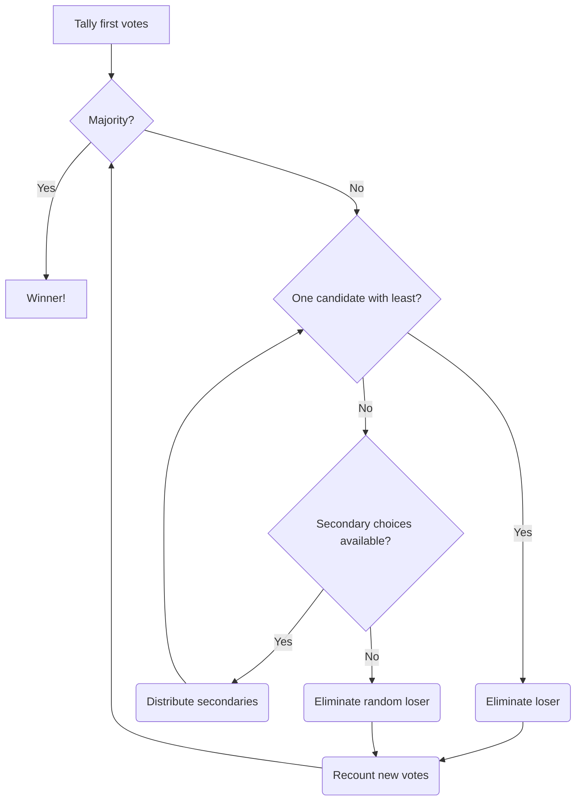

# Alternative Vote Algorithm

### In Plain English

Begin by counting everybody's first-place votes (the candidates they ranked first). If one candidate has a majority\*, they win. If not, check if there is a single biggest loser (one person with the fewest number of votes). If there is, eliminate that candidate and redistribute their votes to the voters' second-place candidates. If two or more candidates are tied for last, use second-, third-, fourth- (etc.) place votes to break that tie, with the loser's votes being redistributed. If the tie cannot be broken, randomly eliminate one of the losers. Continue counting, each time checking for one person with a majority and, if none exists, redistributing the votes of the biggest loser (this may end up going to third-place votes, etc., if second-place votes would have gone to a candidate who has already been eliminated). Bear in mind that if none of the candidates a voter ranked is left, that vote is discarded. Eventually, one candidate will have a majority or only one will remain, in which case that candidate is the winner.

\*A majority is defined as the [Droop quota](https://en.wikipedia.org/wiki/Droop_quota).

### Flowchart

